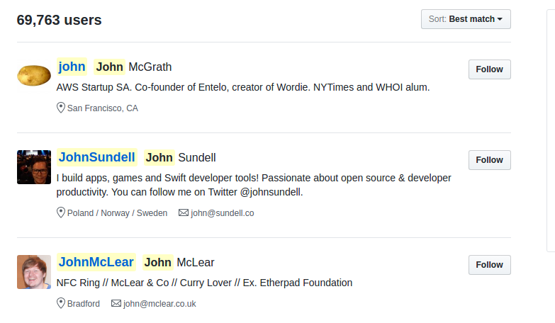
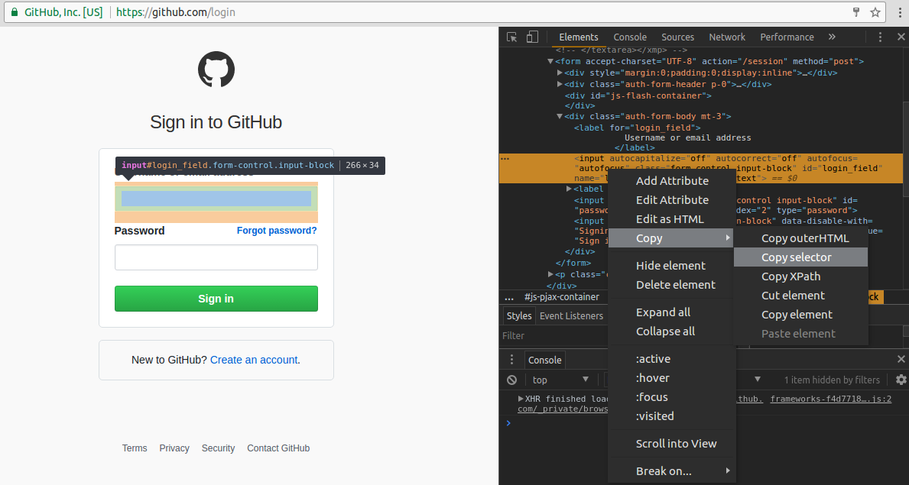
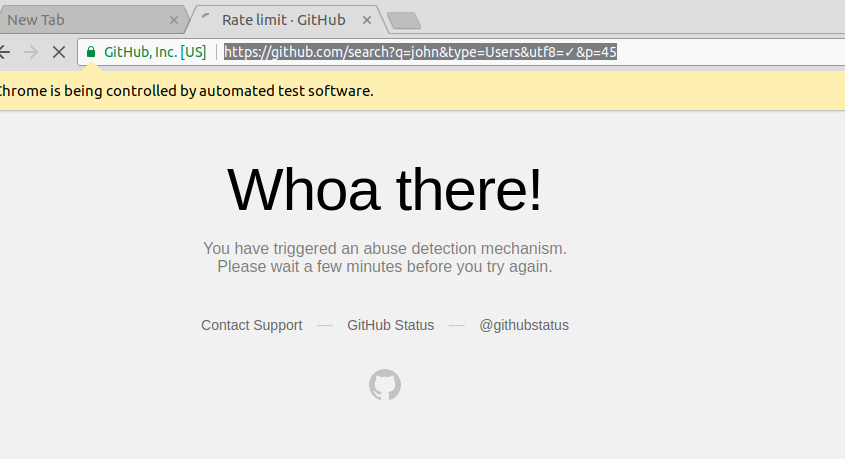

# Getting started with Puppeteer and Chrome Headless for Web Scraping

**Here is a link to [Medium Article](https://medium.com/@e_mad_ehsan/getting-started-with-puppeteer-and-chrome-headless-for-web-scrapping-6bf5979dee3e)**

**Here is the [Chinese Version](https://github.com/csbun/thal) thanks to [@csbun](https://github.com/csbun/)** 


[`Puppeteer`](https://github.com/GoogleChrome/puppeteer) is official tool for Chrome Headless by Google Chrome team. Since the official announcement of Chrome Headless, many of the industry standard libraries for automated testing have been discontinued by their maintainers. Including **PhantomJS**. **Selenium IDE for Firefox** has been discontinued due to lack of maintainers.

For sure, Chrome being the market leader in web browsing, **Chrome Headless** is going to industry leader in **Automated Testing** of web applications. So, I have put together this starter guide on how to get started with `Web Scraping` in **Chrome Headless**.

## TL;DR
In this guide we will scrap GitHub, login to it and extract and save emails of users using `Chrome Headless`, `Puppeteer`, `Node` and `MongoDB`. Don't worry GitHub have rate limiting mechanism in place to keep you under control but this post will give you good idea on Scrapping with Chrome Headless and Node. Also, alway stay updated with the [documentation](https://github.com/GoogleChrome/puppeteer/blob/master/docs/api.md) because `Puppeteer` is under development and APIs are prone to changes.

## Getting Started
Before we start, we need following tools installed. Head over to their websites and install them.
* [Node 8.+](https://nodejs.org)
* [MongoDB](http://mongodb.com)

## Project setup

Start off by making the project directory

```
$ mkdir thal
$ cd thal
```

Initiate NPM. And put in the necessary details.

```
$ npm init
```

Install `Puppeteer`. Its not stable and repository is updated daily. If you want to avail the latest functionality you can install it directly from its GitHub repository.

```
$ npm i --save puppeteer
```

Puppeteer includes its own chrome / chromium, that is guaranteed to work headless. So each time you install / update puppeteer, it will download its specific chrome version.

## Coding
We will start by taking a screenshot of the page. This is code from there documentation.

### Screenshot

```js
const puppeteer = require('puppeteer');

async function run() {
  const browser = await puppeteer.launch();
  const page = await browser.newPage();

  await page.goto('https://github.com');
  await page.screenshot({path: 'screenshots/github.png'});

  browser.close();
}

run();
```

If its your first time using `Node` 7 or 8, you might be unfamiliar with `async` and `await` keywords. To put  `async/await` in really simple words, an async function returns a Promise. The promise when resolves might return the result that you asked for. But to do this in a single line, you tie the call to async function with `await`.

Save this inside `index.js` inside project directory. Run in with

```
$ node index.js
```

The screenshot is saved inside `screenshots/` dir.


### Login to GitHub
If you go to GitHub and search for *john*, then click the users tab. You will see list of all users with names.



Some of them have made their emails publicly visible and some have chosen not to. But the thing is you can't see these emails without logging in. So, lets login. We will make heavy use of [Puppeteer documentation](https://github.com/GoogleChrome/puppeteer/blob/master/docs/api.md).

Add a file `creds.js` in project root. I highly recommend signing up for new account with a new dummy email because you **might** end up getting your account blocked.

```js
module.exports = {
    username: '<GITHUB_USERNAME>',
    password: '<GITHUB_PASSWORD>'
}
```

Add another file `.gitignore` and put following content inside it:

```txt

node_modules/
creds.js
```

#### Launch in non headless
For visual debugging, make chrome launch with GUI by passing an object with `headless: false` to `launch` method.

```js
const browser = await puppeteer.launch({
  headless: false
});
```

Lets navigate to login

```js
await page.goto('https://github.com/login');
```

Open [https://github.com/login](https://github.com/login) in your browser. Right click on input box below **Username or email address**. From developers tool, right click on the highlighted code and
select `Copy` then `Copy selector`.



Paste that value to following constant

```js
const USERNAME_SELECTOR = '#login_field'; // "#login_field" is the copied value
```

Repeat the process for Password input box and Sign in button. You would have following

```js
// dom element selectors
const USERNAME_SELECTOR = '#login_field';
const PASSWORD_SELECTOR = '#password';
const BUTTON_SELECTOR = '#login > form > div.auth-form-body.mt-3 > input.btn.btn-primary.btn-block';
```

#### Logging in
Puppeteer provides methods `click` to click a DOM element and `type` to type text in some input box. Let's fill in the credentials then click login and wait for redirect.

Up on top, require `creds.js` file.

```js
const CREDS = require('./creds');
```

And then

```js
await page.click(USERNAME_SELECTOR);
await page.type(CREDS.username);

await page.click(PASSWORD_SELECTOR);
await page.type(CREDS.password);

await page.click(BUTTON_SELECTOR);

await page.waitForNavigation();
```

### Search GitHub
Now, we have logged in. We can programmatically click on search box, fill it and on the results page, click users tab. But there's an easy way. Search requests are usually GET requests. So, every thing is sent via url. So, manually type `john` inside search box and then click users tab and copy the url. It would be

```js
let searchUrl = 'https://github.com/search?q=john&type=Users&utf8=%E2%9C%93';
```

Rearranging a bit

```js
let userToSearch = 'john';
let searchUrl = 'https://github.com/search?q=' + userToSearch + '&type=Users&utf8=%E2%9C%93';
```

Lets navigate to this page and wait to see if it actually searched?

```js
await page.goto(searchUrl);
await page.waitFor(2*1000);
```

### Extract Emails
We are interested in extracting `username` and `email` of users. Lets copy the DOM element selectors like we did above.

```js
let LIST_USERNAME_SELECTOR = '#user_search_results > div.user-list > div:nth-child(1) > div.d-flex > div > a';
let LIST_EMAIL_SELECTOR = '#user_search_results > div.user-list > div:nth-child(2) > div.d-flex > div > ul > li:nth-child(2) > a';

let LENGTH_SELECTOR_CLASS = 'user-list-item';
```

You can see that I also added `LENGTH_SELECTOR_CLASS` above. If you look at the github page's code inside developers tool, you will observe that `div`s with class `user-list-item` are actually housing information about a single user each.

Currently one way to extract text from an element is by using `evaluate` method of `Page` or `ElementHandle`. When we navigate to page with search results, we will use `page.evaluate` method to get the length of users list on the page. The `evaluate` method evaluates the code inside browser context.

```js
let listLength = await page.evaluate((sel) => {
    return document.getElementsByClassName(sel).length;
  }, LENGTH_SELECTOR_CLASS);
```

Let's loop through all the listed users and extract emails. As we loop through the DOM, we have to change index inside the selectors to point to the next dom element. So, I put the `INDEX` string at the place where we want to place the index as we loop through.

```js
// let LIST_USERNAME_SELECTOR = '#user_search_results > div.user-list > div:nth-child(1) > div.d-flex > div > a';
let LIST_USERNAME_SELECTOR = '#user_search_results > div.user-list > div:nth-child(INDEX) > div.d-flex > div > a';
// let LIST_EMAIL_SELECTOR = '#user_search_results > div.user-list > div:nth-child(2) > div.d-flex > div > ul > li:nth-child(2) > a';
let LIST_EMAIL_SELECTOR = '#user_search_results > div.user-list > div:nth-child(INDEX) > div.d-flex > div > ul > li:nth-child(2) > a';
```

The loop and extraction

```js
for (let i = 1; i <= listLength; i++) {
    // change the index to the next child
    let usernameSelector = LIST_USERNAME_SELECTOR.replace("INDEX", i);
    let emailSelector = LIST_EMAIL_SELECTOR.replace("INDEX", i);

    let username = await page.evaluate((sel) => {
        return document.querySelector(sel).getAttribute('href').replace('/', '');
      }, usernameSelector);

    let email = await page.evaluate((sel) => {
        let element = document.querySelector(sel);
        return element? element.innerHTML: null;
      }, emailSelector);

    // not all users have emails visible
    if (!email)
      continue;

    console.log(username, ' -> ', email);

    // TODO save this user
  }
```

Now if you run the script with `node index.js` you would see usernames and there corresponding emails printed.

### Go over all the pages
First we would estimate the last page number with search results. At search results page, on top, you can see **69,769 users** at the time of this writing.

**Fun Fact: If you compare with the previous screenshot of the page, you will notice that 6 more *john* s have joined GitHub in the matter of a few hours.**


Copy its selector from developer tools. We would write a new function below the `run` function to return the number of pages we can go through.

```js
async function getNumPages(page) {
  let NUM_USER_SELECTOR = '#js-pjax-container > div.container > div > div.column.three-fourths.codesearch-results.pr-6 > div.d-flex.flex-justify-between.border-bottom.pb-3 > h3';

  let inner = await page.evaluate((sel) => {
    return document.querySelector(sel).innerHTML;
  }, NUM_USER_SELECTOR);

  // format is: "69,803 users"
  inner = inner.replace(',', '').replace(' users', '');

  let numUsers = parseInt(inner);

  console.log('numUsers: ', numUsers);

  /*
  * GitHub shows 10 resuls per page, so
  */
  let numPages = Math.ceil(numUsers / 10);
  return numPages;
}
```

At the bottom of the search results page, if you hover the mouse over buttons with page numbers, you can see they link to the next pages. The link to 2nd page with
results is `https://github.com/search?p=2&q=john&type=Users&utf8=%E2%9C%93`. Notice the `p=2` query parameter in the URL. This will help us navigate to the next page.

After adding an outer loop to go through all the pages around our previous loop, the code looks like

```js
let numPages = await getNumPages(page);

console.log('Numpages: ', numPages);

for (let h = 1; h <= numPages; h++) {

	let pageUrl = searchUrl + '&p=' + h;

	await page.goto(pageUrl);

  	let listLength = await page.evaluate((sel) => {
    		return document.getElementsByClassName(sel).length;
    	}, LENGTH_SELECTOR_CLASS);

	for (let i = 1; i <= listLength; i++) {
	  	// change the index to the next child
		let usernameSelector = LIST_USERNAME_SELECTOR.replace("INDEX", i);
		let emailSelector = LIST_EMAIL_SELECTOR.replace("INDEX", i);

    	let username = await page.evaluate((sel) => {
        		return document.querySelector(sel).getAttribute('href').replace('/', '');
      		}, usernameSelector);

    	let email = await page.evaluate((sel) => {
        		let element = document.querySelector(sel);
        		return element? element.innerHTML: null;
      		}, emailSelector);

		// not all users have emails visible
		if (!email)
			continue;

		console.log(username, ' -> ', email);

    	// TODO save this users
	}
}
```

### Save to MongoDB
The part with `puppeteer` is over now. We will use `mongoose` to store the information in to `MongoDB`. Its an [ORM](https://en.wikipedia.org/wiki/Object-relational_mapping), actually just a library to facilitate information storage and retrieval from the database.

```
$ npm i --save mongoose
```

MongoDB is a Schema-less NoSQL database. But we can make it follow some rules using Mongoose. First we would have to create a `Model` which is just representation of MongoDB `Collection` in code. Create a directory `models`. Create a file `user.js` inside and put the following code in it, the structure of our collection. Next whenever we insert something into `users` collection with mongoose, it would have to follow this structure.

```js

const mongoose = require('mongoose');

let userSchema = new mongoose.Schema({
    username: String,
    email: String,
    dateCrawled: Date
});

let User = mongoose.model('User', userSchema);

module.exports = User;
```

Let's now actually insert. We don't want duplicate emails in our database. So, we only insert a user's information if the email is not already present. Otherwise we would just update the information. For this we would use mongoose's `Model.findOneAndUpdate` method.

At the top of `index.js` add the imports

```js
const mongoose = require('mongoose');
const User = require('./models/user');
```

Add the following function at bottom of `index.js` to **upsert** (update or insert) the User model

```js
function upsertUser(userObj) {

	const DB_URL = 'mongodb://localhost/thal';

  	if (mongoose.connection.readyState == 0) { mongoose.connect(DB_URL); }

    // if this email exists, update the entry, don't insert
	let conditions = { email: userObj.email };
	let options = { upsert: true, new: true, setDefaultsOnInsert: true };

  	User.findOneAndUpdate(conditions, userObj, options, (err, result) => {
    	if (err) throw err;
  	});
}
```

Start MongoDB server. Put following code inside the for loops at the place of comment `// TODO save this user` in order to save the user

```js
upsertUser({
  username: username,
  email: email,
  dateCrawled: new Date()
});
```

To check if you are actually getting users saved, get inside mongo shell

```
$ mongo
> use thal
> db.users.find().pretty()
```

You would see multiple users added there. This marks the crux of this guide.

## Conclusion
Chrome Headless and Puppeteer is the start of a new era in Web Scraping and Automated Testing. Chrome Headless also supports WebGL. You can deploy your scraper in cloud and sit back and let it do the heavy load. Remember to remove the `headless: false` option when you deploy on server.

* While scraping, you might be halted by GitHub's rate limiting



* Another thing I noticed, you cannot go beyond 100 pages on GitHub.

## End note
Deserts symbolize vastness and are witness of the struggles and sacrifices of people who `traversed` through these giant mountains of sand. [**Thal**](https://en.wikipedia.org/wiki/Thal_Desert) is a desert in Pakistan spanning across multiple districts including my home district Bhakkar. Somewhat similar is the case with `Internet` that we `traversed` today in quest of data. That's why I named the repository `Thal`. If you like this effort, please like and share this with others. If you have any suggestions, comment here or approach me directly [@e_mad_ehsan](https://twitter.com/e_mad_ehsan). I would love to hear from you.
