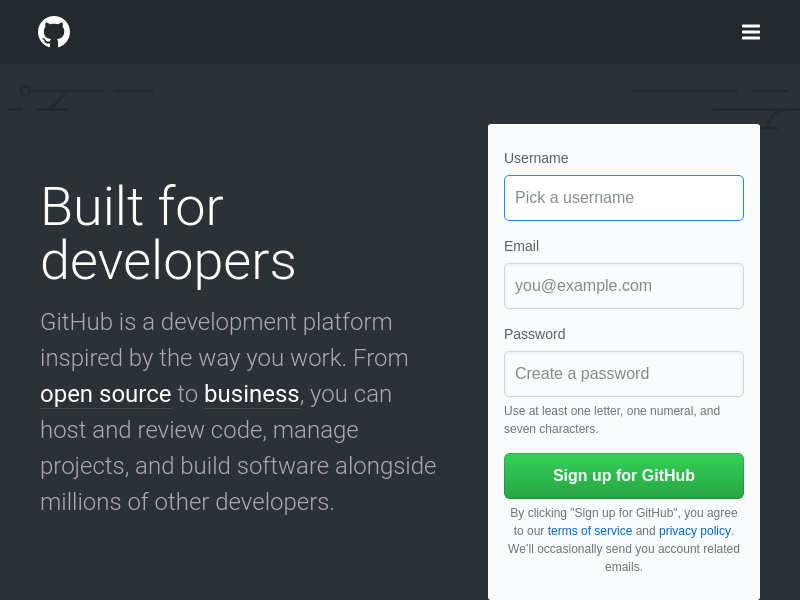
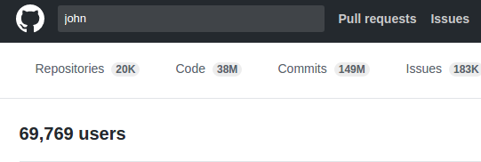

# Scrapping guide to Puppeteer and Chrome Headless

## Foreword
Google Chrome team announced its official tool for chrome headless called `Puppeteer` just this week. Since the official announcement of Chrome Headless in april this year, many of the industry standard libraries for automated testing have discontinued there working. The prominent of these are **PhantomJS** and **Selenium IDE for Firefox**.

For sure, Chrome being the market leader in web browsing, **Chrome Headless** is going to industry leader in **Automated Testing** of web applications. So, I have put together this starter guide on how to get started with `Web Scrapping` **Chrome Headless**.

## TL;DR
In this post we will scrap GitHub, login to it and extract emails of users using `Chrome Headless`, `Puppeteer`, `Node` and `MongoDB`. Don't worry GitHub have rate limiting mechanism in place to keep you under control but this post will give you good idea on Scrapping with Chrome Headless and Node. Also, alway stay updated with the [documentation]() because `Puppeteer` is under development and API are prone to changes.

## Prerequisites
This is a beginners guide assumes that you are familiar with `Javascript`.

## Getting Started
Before we start, we need following tools installed. Head over to there website and install them.
* [Node 8.+](https://nodejs.org)
* [MongoDB](https://mongodb.com)

## Project setup

Start of by making the project directory
```
$ mkdir thal
$ cd thal
```
Initiate NPM. And put in the necessary details.
```
$ npm init
```
Now install `Puppeteer`. As of this writing, its latest version is `0.9.0` which available via `npm repository`. But we want to avail the latest functionality. So, we would install it directly from its GitHub repository's master branch.
```
$ npm i --save https://github.com/GoogleChrome/puppeteer/
```
Puppeteer includes its own chrome, that is guaranted to work headless. So each time you install / update puppeteer, it will download its specific chrome version. Also install [`mongoose`](http://mongoosejs.com/), a wrapper around MongoDB to help ease the insertion, updation operations.
```
$ npm i --save mongoose
```
## Coding
We wil start by taking a screenshot of the page. This is code from there documentation.

### Screenshot
```js
const puppeteer = require('puppeteer');

async function run() {
  const browser = await puppeteer.launch();
  const page = await browser.newPage();
  
  await page.goto('https://github.com');
  await page.screenshot({path: 'screenshots/github.png'});
  
  browser.close();
}

run();
```

If its your first time using `Node` 7 or 8, you might be unfamiliar with `async` and `await` keywords. For a long time, a negative argument put against `Node` was [Callback Hell](http://callbackhell.com/). [`Promises`](https://developer.mozilla.org/en/docs/Web/JavaScript/Reference/Global_Objects/Promise) came along but still there was something missing. 

To put  `async/await` in really simple words, an async function returns a Promise. The promise when resolves might return the result that you asked for. But to do this in a single line, you tie the call to async function with `await`. 

Save this inside `index.js` inside project directory. Run in with
```
$ node index.js
```
The screenshot is saved inside `screenshots/` dir.



### Login to GitHub
If you go to GitHub and search for "john" without quotes, then click the users tab. You will see list of all users with names. 

 

Some of them have made their emails publically visible and some have choosen not to. But the thing is you can't see these emails without logging in. So, lets login. We will make heavy use of [Puppeteer documentation](https://github.com/GoogleChrome/puppeteer/blob/master/docs/api.md).

Add a file `creds.js` in project root. I highly recomment signing up for new account with a new dummy email because you **might** end up getting your account blocked.
```js
module.exports = {
    username: '<GITHUB_USERNAME>',
    password: '<GITHUB_PASSWORD>'
}
```
Add another file `.gitignore` and put following content inside it:

```
node_modules/
creds.js
```
#### Launch in non headless
For visual debugging, make chrome launch with GUI by passing an object with `headless: false` to `launch` method.
```js
const browser = await puppeteer.launch({
  headless: false
});
```

Lets navigate to login
```js
await page.goto('https://github.com/login');
```

Open [https://github.com/login](https://github.com/login) in your browser. Right click on input box below **Username or email address**. From developers tool, right click on the highlighted code and 
select `Copy` then `Copy selector`. 


Paste that value to following constant

```js
const USERNAME_SELECTOR = '#login_field'; // "#login_field" is the copied value
```
Repeat the process for Password input box and Sign in button. You would have following

```js
// dom element selectors
const USERNAME_SELECTOR = '#login_field';
const PASSWORD_SELECTOR = '#password';
const BUTTON_SELECTOR = '#login > form > div.auth-form-body.mt-3 > input.btn.btn-primary.btn-block';
```
#### Logging in
Puppeteer provides methods `click` to click a DOM element and `type` to type text in some input box. Let's fill in the credentials and type username & password then click login and wait for redirect.

Up on top, `require` `cres.js` file.
```js
const CREDS = require('./creds');
```
And then
```js
await page.click(USERNAME_SELECTOR);
await page.type(CREDS.username);

await page.click(PASSWORD_SELECTOR);
await page.type(CREDS.password);

await page.click(BUTTON_SELECTOR);

await page.waitForNavigation();
```

### Search GitHub
Now, we have logged in. We can programmatically click on search box, fill it and on the results page, click users tab. But there's an easy way. Search requests are usually GET requests. So, every thing is sent via url. So, manually type `john` inside search box and then click users tab and copy the url. It would be

```js
let searchUrl = 'https://github.com/search?q=john&type=Users&utf8=%E2%9C%93';
```

Rearranging a bit

```js
let userToSearch = 'john';
let searchUrl = 'https://github.com/search?q=' + userToSearch + '&type=Users&utf8=%E2%9C%93';
```

Lets navigate to this page and wait to see if it actually searched?

```js
await page.goto(searchUrl);
await page.waitFor(2*1000);
```

### Extract Emails 
We are interested in extracting `username` and `email` of users. Lets copy the DOM element selectors like we did above.

```js
let LIST_USERNAME_SELECTOR = '#user_search_results > div.user-list > div:nth-child(1) > div.d-flex > div > a > em';
let LIST_EMAIL_SELECTOR = '#user_search_results > div.user-list > div:nth-child(2) > div.d-flex > div > ul > li:nth-child(2) > a';
  
let LENGHT_SELECTOR = '#user_search_results > div.user-list > div';
```
You can see that I also added `LENGHT_SELECTOR` above. If you look at the github page's code inside developers tool, you will observe that `div` with class `user-list` is actually housing multiple `div` each containing information about a single user.

`Puppeteer` is in active development and at the time of this writing, it does have support to extract text from DOM elements. The support would be added in [future releases](github.com/GoogleChrome/puppeteer/issues/382).
So, until `puppeteer` supports this, we will rely on `jsdom`, a package available via npm.

```
$ npm i --save jsdom
```

Add the following line at top of `index.js` to include the package.
```js
const jsdom = require('jsdom');
const { JSDOM } = jsdom;
```
Now, when we navigate to page with search results, we will use `page.content` method to get the content of the page as a string and use `jsdom` to parse that into a `DOM` instance. And we can access the normal javascript DOM methods. 

```js
let content = await page.content();
let DOM = new JSDOM(content);

let listLength = DOM.window.document.querySelector(LENGHT_SELECTOR);
listLength = parseInt(listLength);
```

Let's loop through all the listed users and extract emails. As we loop through the DOM, we have to change index to point to the next dom element. So, I put the `INDEX` string at the place where we want to place the index as we loop through.

```js
// let LIST_USERNAME_SELECTOR = '#user_search_results > div.user-list > div:nth-child(1) > div.d-flex > div > a > em';
let LIST_USERNAME_SELECTOR = '#user_search_results > div.user-list > div:nth-child(INDEX) > div.d-flex > div > a > em';
// let LIST_EMAIL_SELECTOR = '#user_search_results > div.user-list > div:nth-child(2) > div.d-flex > div > ul > li:nth-child(2) > a';
let LIST_EMAIL_SELECTOR = '#user_search_results > div.user-list > div:nth-child(INDEX) > div.d-flex > div > ul > li:nth-child(2) > a';
```
The loop and extraction
```js
for (let i = 1; i <= listLength; i++) {
  // change the index to the next child
  let usernameSelector = LIST_USERNAME_SELECTOR.replace("INDEX", i);
  let emailSelector = LIST_EMAIL_SELECTOR.replace("INDEX", i);
  
  let username = DOM.window.document.querySelector(usernameSelector);
  let email = DOM.window.document.querySelector(emailSelector);

  console.log(username, ' -> ', email);
}
```

### Go over all the pages
First we would extimate the last page number in with search results. At search results page, on top, you can see **69,769 users** at the time of this writing.

**Fun Fact: If you compare with the previous screen shot of the page, you will notice that 6 more *john* s have joined GitHub in the matter of a few hours.**



Copy its selector from developer tools. We would write a new function below the `run` function to return the number of pages we can go through.

```js
async function getNumPages(DOM) {
  let NUM_USER_SELECTOR = '#js-pjax-container > div.container > div > div.column.three-fourths.codesearch-results.pr-6 > div.d-flex.flex-justify-between.border-bottom.pb-3 > h3'

  let numUsers = DOM.window.document.querySelector(NUM_USER_SELECTOR).innerHTML;
  numUsers = parseInt(numUsers);

  /*
  * GitHub shows 10 resuls per page, so
  */
  let numPages = Math.ceil( numUsers/10 );
  return numPages;
}
```

At the bottom of the search results page, if you hover the mouse over buttons with page numbers, you can see they link to the next pages. The link to 2nd page with 
results is `https://github.com/search?p=2&q=john&type=Users&utf8=%E2%9C%93`. Notice the `p=2` query paramter in the URL. This will help us navigate to the next page.

After adding an outer loop to go through all the pages around our previous loop, the code looks like
```js
let numPages = getNumPages(DOM);

for (let h = 1; h <= numPages; h++) {

	let pageUrl = searchUrl + '&p=' + h;
	let users = [];

	await page.goto(pageUrl);
	content = await page.content();
	DOM = new JSDOM(content);

	for (let i = 1; i <= listLength; i++) {
		// change the hmtl index to the next child
		let usernameSelector = LIST_USERNAME_SELECTOR.replace("INDEX", i);
		let emailSelector = LIST_EMAIL_SELECTOR.replace("INDEX", i);

		let username = DOM.window.document.querySelector(usernameSelector);
		let email = DOM.window.document.querySelector(emailSelector);

		console.log(username, ' -> ', email);

		users.push({username: username, email: email});
	}
	// TODO save users
}
```

### Save to MongoDB
The part with `puppeteer` is over now. We will use `mongoose` to store the information in to `MongoDB`. Its a ORM (Objec Relational Model FIXME insert wiki link) to store information into the database.

Create a directory `models`. Create a file `user.js` inside and put the following code in it.

```js

const mongoose = require('mongoose');

let userSchema = new mongoose.Schema({
    username: String,
    email: String,
    dateCrawled: Date
});

let User = mongoose.model('User', userSchema);

module.exports = User;
```


---save to db using mongoose ---

## To the Cloud

## End note
Deserts symbolize vastness and are witness of the struggles and sacrifices of people who `Traverse` through these gaint mountains of sand. `Thal` is desert in Pakistan spanning accross multiple districts including my home district. Somewhat similar is the case with `Internet` that we `Traversed` today. That's why I named the repository `Thal`.

If you learned something, please like and share this post.